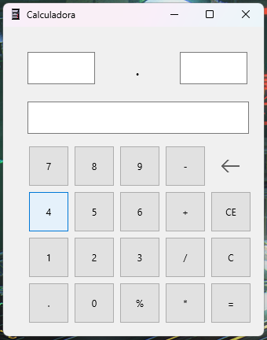

<h1 align="center"> 📟 Calculadora 📟 </h1>

 Projeto pessoal de uma simples calculadora desenvolvida em Delphi 11

 

  <a href="#-tecnologias">Tecnologias</a>

  <a href="https://github.com/luanaraujo/ProjetoCalculadora/blob/main/Win32/Release/Calculadora.exe">Calculadora</a>

## Imagem do programa

  

 

## 🚀 Tecnologia

Esse projeto foi desenvolvido com a seguinte tecnologia:

- Delphi 11

por Luan Araujo :wave:
